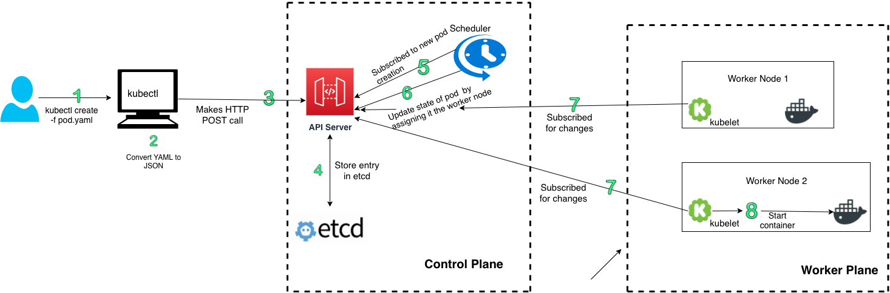

# The Kubernetes Internals

I am on a journey to learn Kubernetes internals by reading and understanding its source code. I am sharing my notes in this repository. If you find this useful then you can star this repository. 

> I am unfamiliar with Go so I might post something basic about it as well.
>
> This guide assumes that you already know Kubernetes basics.

## Section 1: Building Kubernetes source code on Mac

The first thing that we need to do before we can start learning about Kubernetes is to build its source code. Following are the steps that I took to build Kubernetes source code.

## Step 1: Install Docker for MacOS

Download and install Docker for MacOS

## Step 2: Install Go

I recommend you install the latest version of Go using brew package manager

```
brew install go
```

If you already have previously installed Go version then you can upgrade that using `brew upgrade go`

## Step 3: Create Go workspace

Create a directory that you want to use as workspace

```
mkdir bin pkg src
```

Set GOPATH environment variable as well

## Step 4: Get the latest Go code

```
go get -d k8s.io/kubernetes
```

## Step 5: Install gnu-tar & gnu-sed

```
brew install gnu-tar gnu-sed
```

## Step 6: Run quick-release

```
time make quick-release
```

On my machine, it took close to 20 mins for the above command to finish.

```
make quick-release  119.52s user 22.08s system 11% cpu 20:45.34 total
```

## Section 2: What happens when you run `kubectl create -f pod.yaml`?

`kubectl` is a command-line that we use to create Kubernetes objects like pod. Pod is the smallest object that you can create or deploy. So, we will start by understanding how different Kubernetes components interact to create the pod.

We can create a simple pod by using following manifest file `pod.yaml`

```yaml
apiVersion: v1
kind: Pod
metadata:
  name: hello-world
  labels:
    name: hello-world
spec:
  containers:
  - name: hello-world
    image: petegoo/node-express-sample
    resources:
      limits:
        memory: "128Mi"
        cpu: "500m"
    ports:
      - containerPort: 80
```

To create a pod, we will run the following command.

```
$ kubectl create -f pod.yaml
pod "hello-world" created
```

```
$ kubectl get pod
NAME          READY     STATUS              RESTARTS   AGE
hello-world   0/1       ContainerCreating   0          6s
```

```
$ kubectl get pod --watch
NAME          READY     STATUS              RESTARTS   AGE
hello-world   0/1       ContainerCreating   0          14s
hello-world   1/1       Running   0         1m
```

### High level overview

Let's look at the high level overview of how different Kubernetes interact with each other to create a pod.



1. User uses `kubectl` client to create a pod by typing `kubectl create -f pod.yaml`
2. `kubectl` uses it deserialisation and serialisation machinery to convert YAML to JSON. 
3. Kubectl makes an HTTP POST request to `apiserver`
4. The `apiserver` receives the request, validate it, and store the resource in etcd. Only `apiserver` talks to etcd, all other components talk to `apiserver` to perform any action with data store.
5. `scheduler` subscribes to `apiserver` by opening a HTTP connection. `apiserver` sends notification to the scheduler for creation of new pod
6. `scheduler` uses its scheduling algorithm to find the best possible node that should run the pod. `scheduler` does not do the actual task of running the pod. It only changes the state of the pod by specifying the node that should run the pod
7. The work to run the process on the worker node is performed by `kubelet`. Like `scheduler`, kubelet also subscribe to changes by opening an HTTP connection to `apiserver`.
8. When `kubelet` receives a notification for a new pod then it uses Pod specification to start a new container using the container runtime that Kubernetes is uses.

Now, that we have a high level understanding on how different components interacted with each other to create the pod we can now start digging into the code.

